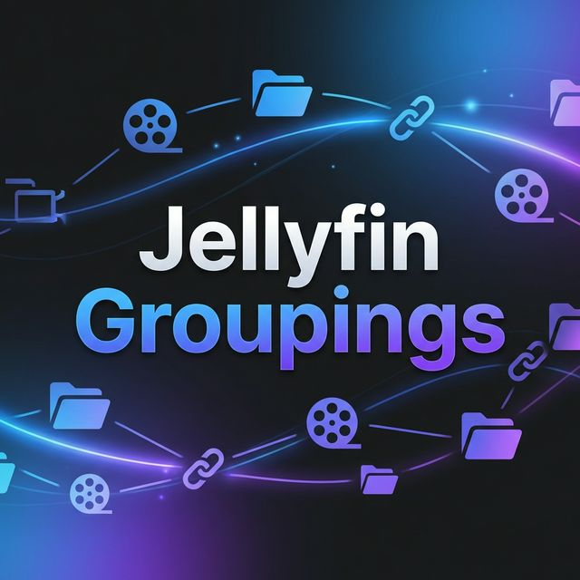

# Jellyfin Groupings

<p align="center">
  
</p>

> **Virtual Libraries Simplified.** Create dynamic Jellyfin libraries using symlinks without duplicating your media.

[](https://github.com/entcheneric/jellyfin-groupings)
[](https://opensource.org/licenses/MIT)

---

> [!NOTE]
> **This project was largely AI-generated.** I'm a CS student who could have written this myself — I just didn't want to. I reviewed the code, understand how it works, and actively maintain it. The AI was basically just a faster keyboard.

**Jellyfin Groupings** is a Flask-powered web utility that allows you to create **virtual libraries** in [Jellyfin](https://jellyfin.org/) by grouping existing media into symlinked directories. 

Instead of messing with Jellyfin's internal collections or duplicating multi-gigabyte files, this app creates a folder structure (e.g., `/virtual/Action/`) filled with symlinks to your real files. You then add these folders to Jellyfin as independent libraries.

## ✨ Features

- 📂 **Metadata-based Groups**: Filter by genre, actor, studio, tag, or year directly from your library.
- 📜 **External List Support**: Sync with **IMDb**, **Trakt**, **TMDb**, **Letterboxd**, **AniList**, or **MyAnimeList** lists.
- ⚡ **Complex Logic**: Combine filters with `AND`, `OR`, and `NOT` (e.g., `Genre: Action AND NOT Genre: Sci-Fi`).
- 🔢 **Smart Sorting**: Prefix filenames with a numeric index based on Rating, Year, Name, or List Order.
- 🐳 **Docker-First**: Designed to run alongside your Jellyfin container with easy path mapping.
- 🛠️ **Auto-Detect**: Scans your filesystem to help you configure path translations automatically.

---

## 🚀 Quick Start with Docker

The easiest way to run Jellyfin Groupings is via Docker Compose.

### 1. Create `docker-compose.yml`

```yaml
services:
  jellyfin-groupings:
    image: ghcr.io/entcheneric/jellyfin-groupings:latest
    container_name: jellyfin-groupings
    ports:
      - "5000:5000"
    volumes:
      # Persistent config (API keys, group definitions)
      - ./config:/app/config
      
      # The output directory where virtual folders (symlinks) are created.
      # This MUST be shared with your Jellyfin container.
      - /mnt/user/jellyfin-groupings-virtual:/groupings
      
      # Your media root. Needed so the app can verify files and follow symlinks.
      # Use the same path Jellyfin uses if possible to simplify mapping.
      - /mnt/user/media:/media:ro
    restart: unless-stopped
```

### 2. Launch the app

```bash
docker-compose up -d
```

Access the UI at `http://your-server-ip:5000`.

---

## ⚙️ Configuration Guide

When running in Docker, you need to tell the app how to translate paths between what **Jellyfin sees** and what **this container sees**.

### Server Settings

| Field | Description |
|---|---|
| **Jellyfin Server URL** | The address of your Jellyfin server (e.g., `http://192.168.1.50:8096`). |
| **API Key** | Generate one in Jellyfin: `Dashboard -> API Keys`. |
| **Base Target Path** | Set this to `/groupings` (the internal path we mapped in Docker). |
| **Media path as Jellyfin sees it** | The path where Jellyfin sees your media (e.g., `/data/movies`). |
| **Same path on this machine** | The path where *this* container sees the same media (e.g., `/media`). |

> [!TIP]
> Use the **"Auto-Detect Settings"** button in the UI! It will scan your media folders and try to match them with what Jellyfin reports to find the correct path translations for you.

---

## 📂 Setting up Jellyfin Libraries

**Jellyfin libraries are not created automatically.** After you sync your groups, follow these steps:

1. In Jellyfin, go to **Dashboard -> Libraries -> Add Media Library**.
2. Set **Content Type** to **`Mixed Movies and Shows`**.
3. Point the library to a **subdirectory** of your virtual root.
   - *Example:* If your Target Path is mapped to `/mnt/user/jellyfin-groupings-virtual` on the host, and you created a group named `Action`, add `/mnt/user/jellyfin-groupings-virtual/Action` to Jellyfin.
   - **Note:** Ensure your Jellyfin container also has this virtual root mounted!

---

## 🛠️ Advanced: Complex Queries

You can use the **Complex** source type to build highly specific libraries. The query syntax supports:
- **Operators**: `AND`, `OR`, `AND NOT`, `OR NOT`
- **Prefixes**: `genre:`, `actor:`, `studio:`, `tag:`, `year:`

**Example:**
`actor:Tom Cruise AND genre:Action AND NOT genre:Sci-Fi`

---

## 👨‍💻 Development

If you'd like to build the project from source or contribute:

1. Clone the repo.
2. Install dependencies: `pip install -r requirements.txt`.
3. Run: `python app.py`.
4. Tests: `python -m pytest`.

### 🧪 Virtual Jellyfin for Development
If you don't have a real Jellyfin server handy, or want to test without affecting your real setup, you can run a **mock Jellyfin server**:

```bash
python start_virtual_jellyfin.py
```

This will start a mock API at `http://localhost:8096`. You can then:
- Access the **Dashboard** at [http://localhost:8096](http://localhost:8096) to see the mock state.
- In the Jellyfin Groupings UI, set the **Server URL** to `http://localhost:8096` and **API Key** to anything (e.g., `test`).

### Unraid Support
An Unraid Community Applications template is available in the `unraid/` directory.

---

## 📜 License

Created and maintained by [entcheneric](https://github.com/entcheneric). 
This project is licensed under the MIT License - feel free to use it however you want!
